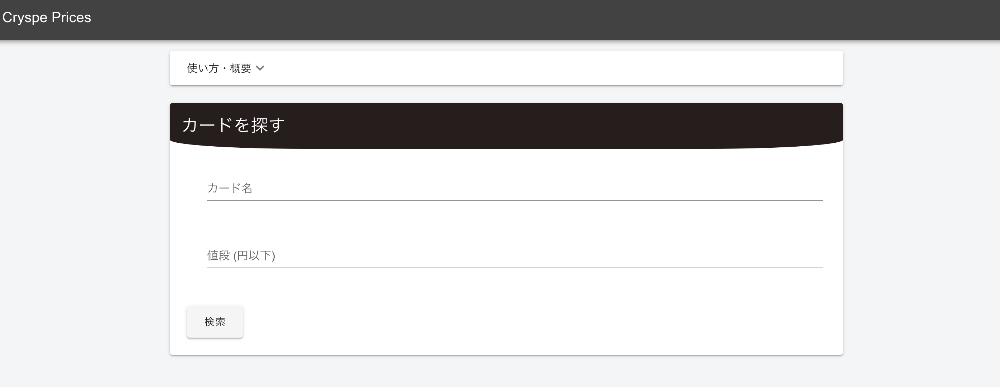
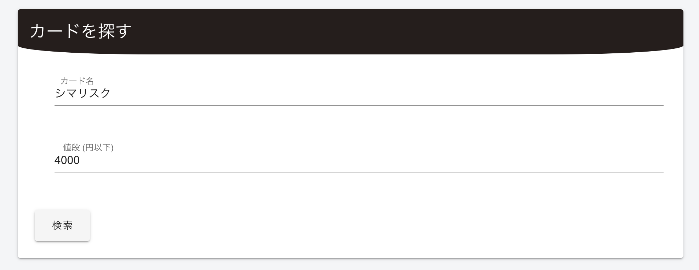
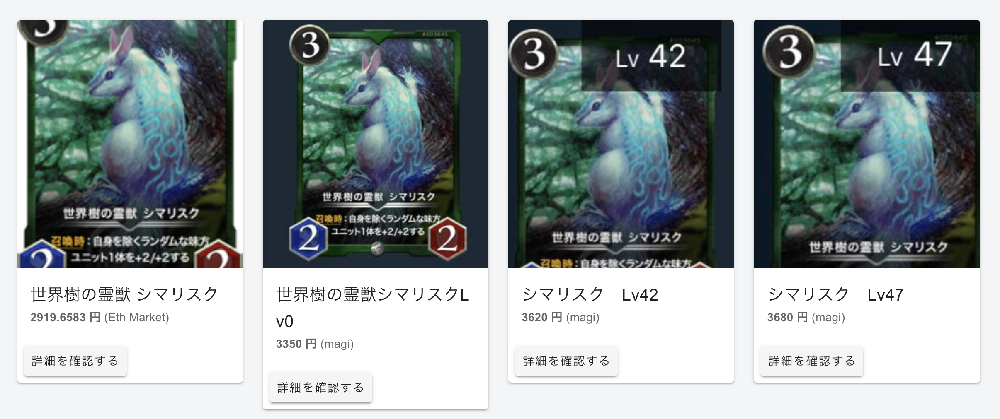

# Cryptospells Prices
  
  

## :video_game: このアプリについて  
Cryptospellsのカードを販売している各サイトのカード販売価格をまとめて検索できます。  
カードを安く買いたい時に、各販売サイトでそれぞれの値段を確認する手間を省けます。
  
  
### [Cryptospells](https://cryptospells.jp/)  
ブロックチェーン技術を使ったトレーディングカードゲームです。ブロックチェーン技術により、カードの種類ごとにゲーム内での発行枚数が制限されており、カードに価値が付与されるため、ユーザー間でカードの売買が行われています。  
(興味を持った方は[こちら](https://cryptospells.jp/?refferal=Rbg_KhLlVPUpIIOioW9abA)から初めていただけると嬉しいです!)
  
  
## 使い方  
### 1. 検索キーワードを入力する  
今回は、カード名:「シマリスク」, 値段「4000円」として検索します。
  

### 2. 検索結果を確認  
カード名に「シマリスク」という文字列が含まれ、 値段が4000円以下のカードが安い順に表示されます。
  
  
  
## :video_game: 開発環境  
### サーバーサイド  
* Python
* Flask
* Beautiful Soup  
* Heroku
  
### フロントエンド
* Vue.js
* Vue-cli
* Vuetify.js
  
  
## :video_game: URL  
https://knakajima3027.github.io/cryspe-prices/
